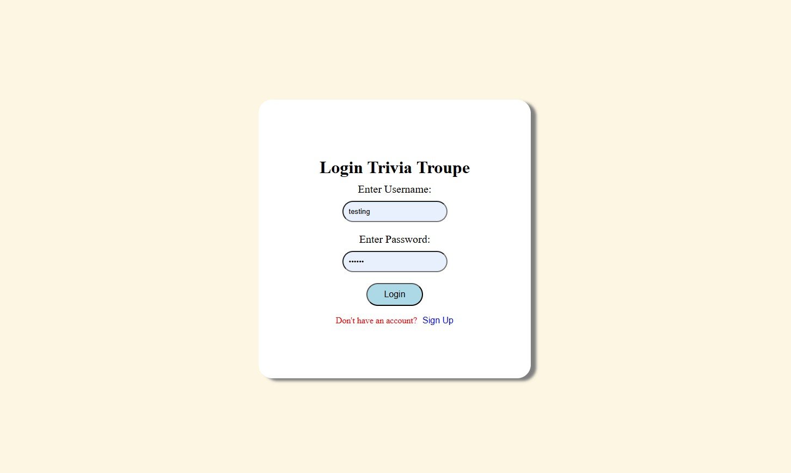
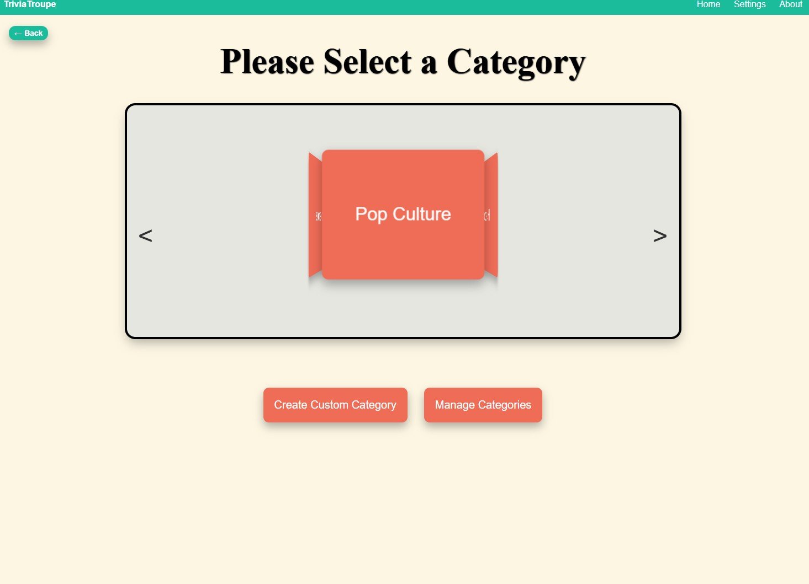
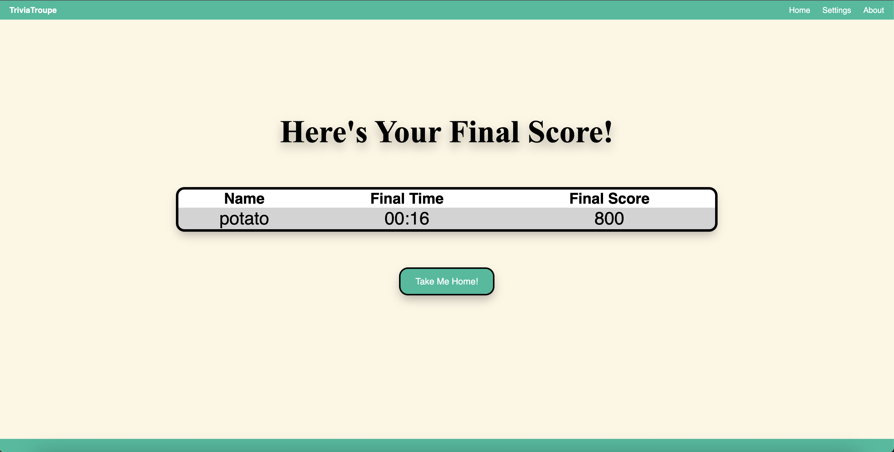
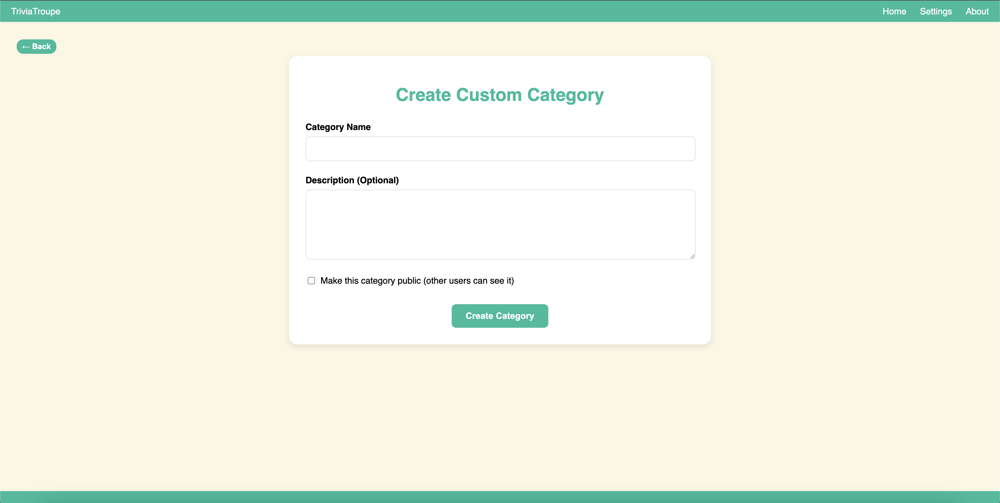
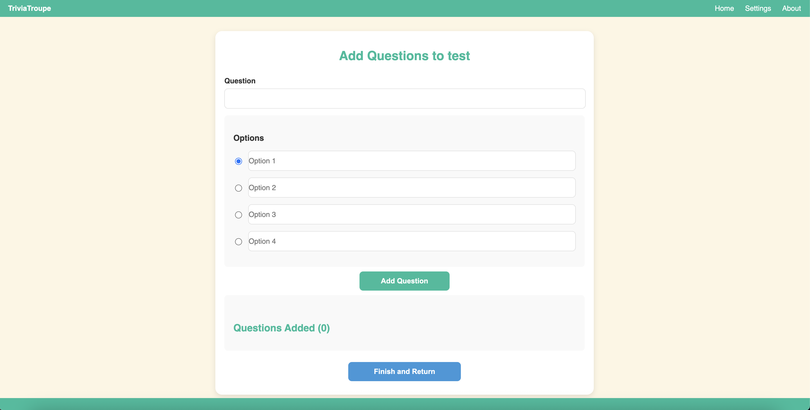
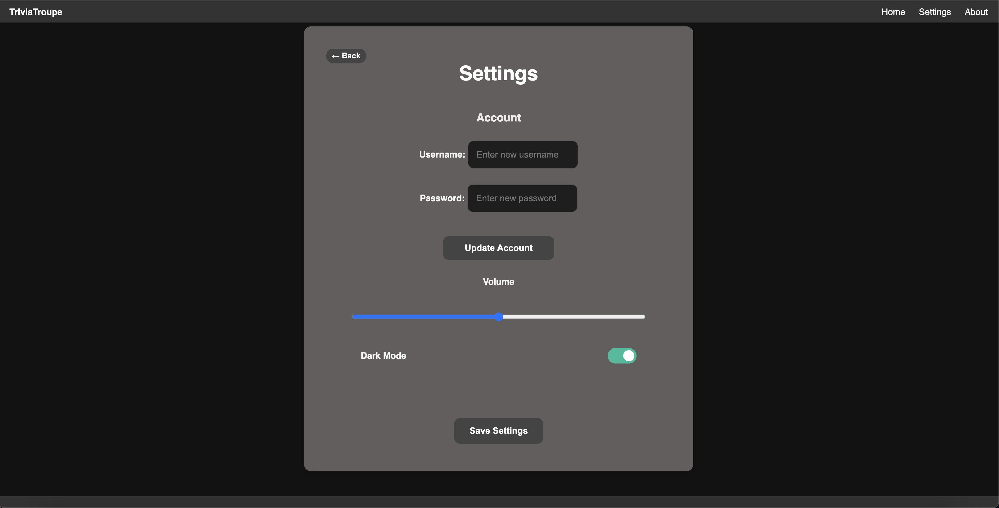
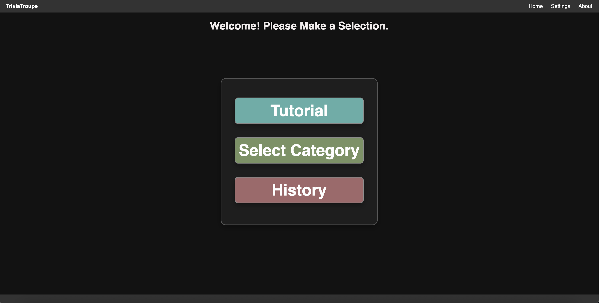

# Trivia Troupe


A fun, browser-based trivia app built by college students! Play games in different categories or make your own trivia sets to challenge friends.

---

## Table of Contents
- [Overview](#overview)
- [Features](#features)
- [Tech Stack](#tech-stack)
- [Getting Started](#getting-started)
- [Folder Breakdown](#folder-breakdown)
- [API Info](#api-info)
- [Contributing](#contributing)
- [License](#license)

---

## Overview

Trivia Troupe is a web trivia game where users can:
- Play questions in categories like Math, Science, History, and Pop Culture
- Create their own categories and questions
- Track scores and play against the clock
- Use the app on desktop or mobile

---

## Features

### User Features
- Sign up / log in  
    
  *Simple and clean login screen*

- Choose from categories like Science, Math, Pop Culture, or create your very own category! 
    
  *A look at how users pick trivia categories*

- Answer multiple-choice questions in timed challenges  
    
  *Sample questions from the Pop Culture category*

- View scores after each game
  
  *Sample of how user is scored*
  
- Create your own trivia sets
  
  *Simple Screen to create a custom category*
  
  *Simple Form to publish questions within the custom category*
  
- Toggle dark mode
  
  *Simple Settings page for Account Info and minor personal adjustments*
  
  *A sample of the main screen in dark mode*

### Developer Features
- Responsive design
- REST API with Flask
- MongoDB for data storage

---

## Tech Stack

**Frontend**: HTML, CSS, JavaScript  
**Backend**: Python, Flask, MongoDB, PyMongo

---

## Getting Started


### Requirements
- Python 3.8+
- MongoDB
- A web browser

### Backend Setup
```bash
git clone https://github.com/yourusername/trivia-troupe.git
cd trivia-troupe
python -m venv venv
source venv/bin/activate  # On Windows: venv\Scripts\activate
pip install flask pymongo flask-cors python-dotenv bcrypt
```

### Environment Variables
```bash
Create a `.env` file in the root of the project and add the following:

MONGO\_URI=mongodb://localhost:27017/

```

### Seed the Database
````

To load some sample trivia questions into your MongoDB:

```bash
cd backend
python seed_questions.py
````

### Start the Backend Server

Run the Flask backend server:

```bash
python server.py
```

### Frontend

Open `src/index.html` in your web browser.
For a smoother experience, you can also use a local development server like Live Server (VS Code extension) or Python's built-in HTTP server.


## Folder Breakdown
```bash
├── assets
├── backend
│   ├── config.py
│   ├── database.py
│   ├── models
│   │   ├── question_model.py
│   │   └── user_model.py
│   ├── routes
│   │   ├── custom_categories.py
│   │   ├── questions.py
│   │   └── users.py
│   ├── seed_questions.py
│   └── server.py
└── src
    ├── about.html
    ├── add-questions.html
    ├── category.html
    ├── create-category.html
    ├── finalScore.html
    ├── history.html
    ├── index.html
    ├── mainScreen.html
    ├── manage-categories.html
    ├── questionPage.html
    ├── scripts
    ├── settings.html
    ├── styles
    └── team.html
```

## API Info

The Trivia Troupe API is a RESTful service built with Flask that manages trivia questions, user accounts, and game data. Below are the key endpoints:

### Authentication

| Endpoint | Method | Description |
|----------|--------|-------------|
| `/register` | POST | Register a new user |
| `/login` | POST | Authenticate a user |
| `/update-password` | POST | Update a user's password |
| `/update-username` | POST | Update a user's username |

### Questions

| Endpoint | Method | Description |
|----------|--------|-------------|
| `/questions` | GET | Get questions (filter by category with `?category=Science`) |
| `/questions?custom_category_id={id}` | GET | Get questions from a custom category |

### Custom Categories

| Endpoint | Method | Description |
|----------|--------|-------------|
| `/custom-categories` | GET | Get available custom categories |
| `/custom-categories` | POST | Create a new custom category |
| `/custom-categories/{category_id}/questions` | POST | Add a question to a custom category |
| `/custom-categories/{category_id}` | DELETE | Delete a custom category |

### Game History

| Endpoint | Method | Description |
|----------|--------|-------------|
| `/history` | GET | Get a user's game history and stats |
| `/history` | POST | Save a completed game to history |

### Example Requests

#### Get Questions
```bash
curl -X GET http://127.0.0.1:5000/questions?category=Science
```

#### Create Custom Category
```bash
curl -X POST http://127.0.0.1:5000/custom-categories \
  -H "Content-Type: application/json" \
  -d '{"name": "Movies", "creator": "username", "description": "Movie trivia", "is_public": true}'
```

#### Save Game History
```bash
curl -X POST http://127.0.0.1:5000/history \
  -H "Content-Type: application/json" \
  -d '{"username": "username", "category": "Science", "score": 800, "time": "01:45"}'
```

---

## License

Trivia Troupe is licensed under the MIT License.

```
MIT License

Copyright (c) 2025 Trivia Troupe Team
## License

**Ye Olde MIT License**

Hear ye, hear ye!  
Let it be known across the realms of Computer Science and beyond:

Henceforth, permission is granted, free of charge, to any noble soul who happeneth upon this humble Software (henceforth referred to as “The Trivia Troupe”) to use, replicate, alter, conjure, distribute, bequeath, or transmogrify the Software, be it for glory, learning, or sheer amusement.

Thou mayest:
- Hacketh the code for thine own scholarly quests
- Mold it into a final project due upon the morrow
- Share it with fellow knights, scholars, or that one dude who never shows up to group meetings

However, let this scroll bear a solemn warning:  
**THE SOFTWARE IS PROVIDED "AS IS", WITHOUT WARRANTY OF ANY KIND**, express or implied, including (but not limited to) enchantments of merchantability, sorcery of fitness for a particular purpose, or noninfringement of forbidden hexes.

Should chaos ensue, be it in the form of bugs, crashing spells, or thine GPA plunging into the abyss — the authors accept no responsibility, moral, legal, or mystical.

Go forth, brave coder, and may your deployments be ever successful.

```